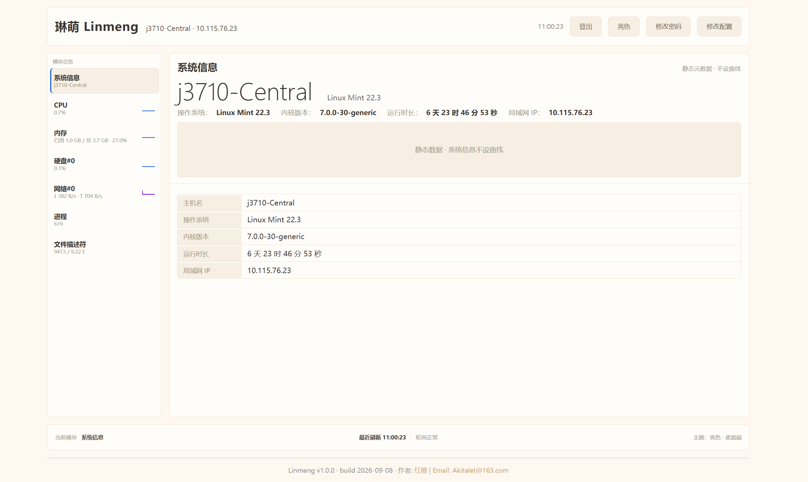

# 琳萌（Linmeng）· Linux 系统信息监视器

琳萌 · linmeng 是一个简易轻量级局域网 Linux 系统信息监视器，用户通过浏览器即可实时查看被监视主机的系统运行与基础信息。核心实体：系统快照、指标项、监视器、会话、配置config。项目主要使用Go语言搭建，前端为内嵌的单页仪表盘，纯局域网、端口 8002，无数据库、极低资源占用。

## 特性

- **单二进制部署**：Go 编译为单一静态二进制，零运行时依赖，低内存占用；systemd 管理，开箱即用。
- **后台缓存采样**：后台循环采集缓存最新快照，HTTP 请求即时返回；重启后复用缓存实现秒开。
- **浏览器仪表盘**：内嵌单页仪表盘（HTML/CSS/JS），有深浅双主题，响应式适配窄屏。
- **覆盖系统资源**：主机、CPU、内存、磁盘、网络、GPU 与系统级指标（可见 [监视指标](#监视指标)）。
- **运维命令行工具**：内置 `linmeng CLI`，数字菜单逐层操作，封装 systemctl / 日志 / 配置 / 回滚等日常运维，在终端使用命令 `linmeng` 即可调起运维工具。
- **只读轻量**：除后台缓存覆盖写外不做写操作；不引入数据库。
- **部分参数可空**：GPU、CPU 当前频率、磁盘 IO 占用率等无统一数据源的指标，在不可采集时返回 `null`（模块隐藏、字段占位），不影响整体运行。

## 工作原理

前后端一体化单体架构：Go 进程托管内嵌仪表盘并对外提供 JSON 接口；系统信息只读采集，写入内存与快照缓存文件；浏览器每 `采集周期设定值`（默认 2 秒）发起一次 HTTP 轮询获取最新数据，前端据此更新指标与绘制曲线。

## 快速开始 · 部署

前置条件：部署机器为 **Linux（systemd 发行版）**，如 Debian/Ubuntu、Linux Mint。

安装本项目有2种方法：

**1. 自动安装：** 

本项目内置了自动安装脚本`install.sh`，通过以下指令可以自动执行安装安装：

```bash
# 1. 构建二进制（开发机）
go build -o linmeng .

# 2. 放置到目标机（默认监听 0.0.0.0:8002）
sudo mkdir -p /opt/linmeng && sudo install -m 0755 linmeng /opt/linmeng/linmeng

# 3. 注册并启动 systemd 服务（含开机自启）
sudo systemctl enable --now linmeng
```

> 访问密码默认为 **`admin123`**，登录后可在页面"修改密码"自定义，或在 `.env` 中设置。

**2. 手动安装：**

根据以下操作完成安装：

```bash
sudo mkdir -p /opt/linmeng
sudo install -m 0755 linmeng_v1.0.0 /opt/linmeng/linmeng          # 程序本体
sudo install -m 0755 linmeng-cli_v1.0.0 /usr/local/bin/linmeng     # 运维 CLI
sudo cp setting.json /opt/linmeng/setting.json
sudo cp .env.example /opt/linmeng/.env.example
sudo nano /opt/linmeng/.env  	#AUTH_PASSWORD=你的密码
sudo cp linmeng.service /etc/systemd/system/linmeng.service
sudo systemctl daemon-reload
sudo systemctl enable --now linmeng
```

**安装完成后验证：（可选）**

```bash
systemctl status linmeng --no-pager
ss -tlnp | grep 8002
curl -i http://127.0.0.1:8002/login
curl -i http://127.0.0.1:8002/api/system/infolinmeng 7 1                                                
# linmeng版本 → v1.0.0
# CLI 版本 → v1.0.0
```


```bash
# 4. 浏览器访问
#    http://<主机局域网IP>:8002  →  输入密码（默认 admin123）登录
```

验证成功：登录后能查看各指标卡片，短期曲线随数据刷新。

## 快捷操作 · 运维 CLI

通过关键字 `linmeng` 唤起命令行运维工具（独立二进制 `linmeng-cli`，安装为 `/usr/local/bin/linmeng`）。

```bash
linmeng          # 进入交互式数字菜单，逐层操作
linmeng 7 1      # 参数直通：跳过菜单直达"工具版本号"
```

CLI 封装服务生命周期、日志查看、配置管理、本地快照摘要、运行自检、防火墙放行、更新与回滚等日常运维命令，均以**中文**展示。

## 监视指标

| 模块 | 指标 |
|------|------|
| 系统信息 | 主机名、操作系统、内核版本、运行时长、局域网 IP |
| CPU | 总使用率、逐核使用率、负载均、当前核心频率 |
| 内存 | 总量 / 可用 / 已用 / 使用率、buffer/cache、交换分区 |
| 磁盘 | 根分区空间 / inode、逐物理盘 IO 占用率与吞吐 / IOPS |
| 网络 | 逐物理网卡流量 / 速率、TCP 已建连 |
| 进程/文件操作符 | 进程总数、文件描述符占用 |
| GPU | 名称、数量、平均 / 逐卡使用率 |

## 目录结构（简述）

```
linmeng/
├── main.go                 # 入口
├── setting.json            # 配置项
├── .env.example            # 机密配置模板（password）
├── install.sh              # 一键安装脚本（本体+CLI+配置+systemd）
├── cmd/linmeng-cli/        # 运维 CLI 入口
├── internal/
│   ├── config/             # 配置读取
│   ├── collector/          # 采集、差分、后台缓存
│   ├── cli/                # 运维 CLI 
│   └── http/               # 路由、鉴权、会话
└── web/static/             # 前端页面
```

## 声明

- 1.仅限**局域网内**临时监测或验证原型使用，不设 HTTPS、不暴露公网。
- 2.一次短历史仅保留在前端内存（`setting参数 - history_points` 个快照点，默认 20），用于绘制短期曲线。
- 3.项目产生于我的实际需求，因此仅添加了我用的上的内容，没有做移动端适配。若有想添加的内容，可以下载源码并自行修改，希望本项目对你有帮助！
- 4.项目的代码均为AI生成，但本说明文档为我本人手敲，因此可能介绍方面会有所欠缺，请见谅！对于项目本体，我只提供主要决策和技术选型，可能帮不上什么忙。
- 5.命名来源：Linux资源监视器（Linux Resource Monitor）音译取“Lin”和“Mon”再通过发音润色得到“琳萌”，反向音译得到“linmeng”。

  
<p align="center">
  
</p>
- v1.0.0监控主页面预览
